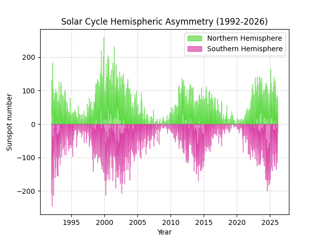

# Solar Hemispheric Analysis

## Description
This project analyzes the asymmetry between the northern and southern hemispheres of the Sun using historical sunspot data.

## Objective
To investigate differences in solar activity between hemispheres and identify patterns across solar cycles.

## Scientific Background
Solar activity is not always symmetric between hemispheres. Differences in sunspot counts between the northern and southern hemispheres can reveal important information about the Sun's magnetic dynamics.

The Sun follows an approximately 11-year activity cycle, but hemispheric dominance can shift over time.

## Methodology
- Load historical sunspot data
- Separate data by hemisphere (North vs South)
- Compare activity levels over time
- Visualize differences using plots

## Results
The analysis shows variations in dominance between hemispheres across different periods, suggesting complex magnetic behavior.

## Visualization

## Technologies Used
- Python
- Matplotlib
- CSV data processing
